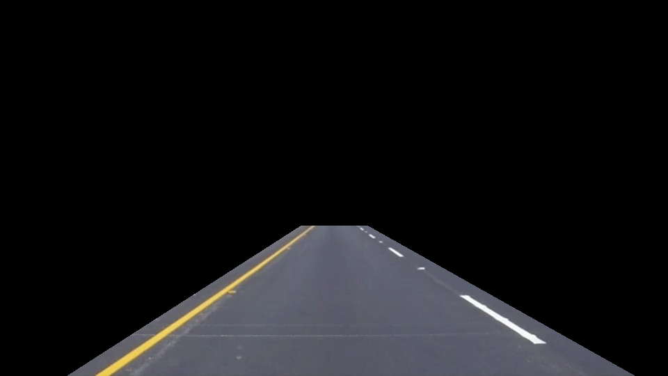
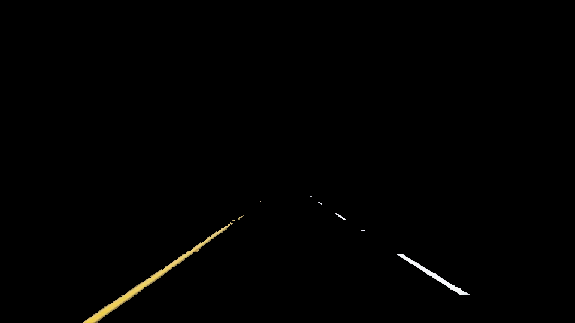
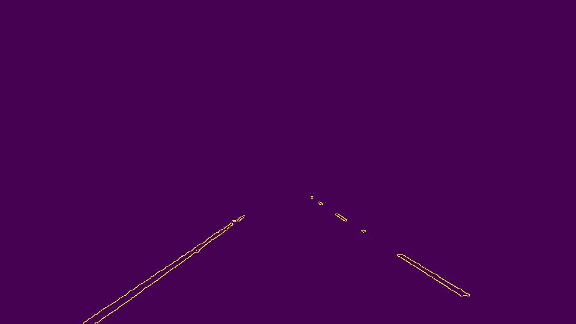
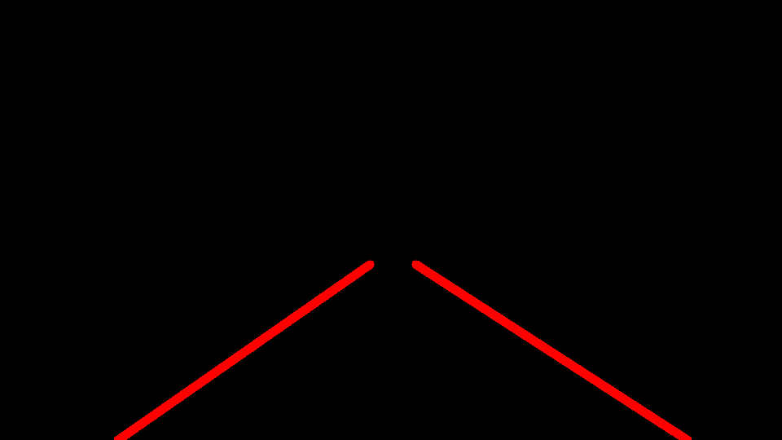

# **Project 1: Finding Lane Lines on the Road** 

The goal of this project is to construct a detector for lane lines in images/videos of roads.

It is a part of the Udacity nanodegree Self Driving Cars, term 1. 

---

### The Lane Line Detector
The lane line detector consists of a series of filters and transforms, as described below.

##### 1. Field of view filter
First of all, the region in which to detect lines is limited to a trapezoid. This will filter out a most irrelevant lines in the image. The field of view can be fairly narrow, at least on more or less straight roads as featured in the project test videos. See [Future Improvements](#future-improvements) for further discussions on field of view. 

{:height="50%" width="50%"}

##### 2. Color filter
Even within the field of view, lines originating from other objects than lane lines will be detected, e.g. curbs, car markings and tarmac differences. Varying lighting conditions may also cause problems. To get rid of some of these lines, a color filter can be applied since lane lines are either yellow or white.

{:height="50%" width="50%"}

To facilitate color filtering, the image is transformed into the [HSV color space](https://en.wikipedia.org/wiki/HSL_and_HSV). This makes it easier to define ranges for specific hues to be used in a filter. HSL might be an even better fit, especially for white color, but satisfactorty results was achieved with HSV.

##### 3. Grey scale conversion
With most irrelevant lines filtered out, the line detection can start. To begin with, the image is converted to one color channel (such as grey scale). In this way, the pixel values are scalars, rather than a vector. It will  make it easier and faster to detect lines using gradient methods.

##### 4. Gaussian blur filter
To suppress noise and rouge gradients in the image, a Gaussian blur filter is applied to the greyscale image.

##### 5. Canny edge detection
Edge detection is performed using [Canny's algorithm](https://en.wikipedia.org/wiki/Canny_edge_detector). It is essentially calculating image gradients, i.e. the differences in adjacent pixel values. All pixels with a gradient above a specified threshold are stored. 

{:height="50%" width="50%"}

##### 6. Hough transform
Due to various imperfections, the Canny edge detector will not necessarily yield complete lines. For instance, they may have noisy edges or missing pixels. Thus, to be able to group the edges into proper lines, the [Hough Transform](https://en.wikipedia.org/wiki/Hough_transform) is applied.

It will transform detected edge pixels into polar coordinates, where a straight line is represented as a point. Sampling lines going through a point in the image plane will render a sinusoidal curve in Hough space. Moreover, the points in a line will cause intersecting sinusoidal curves. Thus, the problem has been transformed to find these intersections. This is acocmplished with a voting procedure using a configurable threshold.

{:height="50%" width="50%"}

##### 7. Draw lines
Finally, the object is to draw a single line that indicates the left and right lanes, respectively. Some grouping can be achieved with Hough parameters like `max_line_gap`, but still the lines given by the Hough Transform needs to be further processed.

Due to the camera field of view, real lane lines will not be close to horizontal or vertical. Thus, by determining the slope of the detected lines, it is possible to keep only lines that are probable as lane lines. After sorting filtered lane line segments into left and right using the sign of their slope, they are averaged by calculating the running means. The average lines is then extrapolated to the border of the field of view and plotted on top of the original image.

{:height="50%" width="50%"}

---

### Future Improvements

##### Field of view
The field of view is set rather narrowly, which works well for the mostly straight road examples. However, this would cause problems in more general conditions, such as sharp curves, hills and multilane situations. The field of view would have to be extended considerably in these cases. Since this will cause much more lines to be retained, other parts of the filter pipeline must be improved.  

##### Curved roads
The extrapolated lines are a good fit when the road is straight, but not for sharply curved roads. A potiential solution would be to detect/fit a polynomial instead. 

##### Noise
In videos, the lane line plotting is somewhat jerky. Some sort of smoothing across frames should be added to remedy this. 
