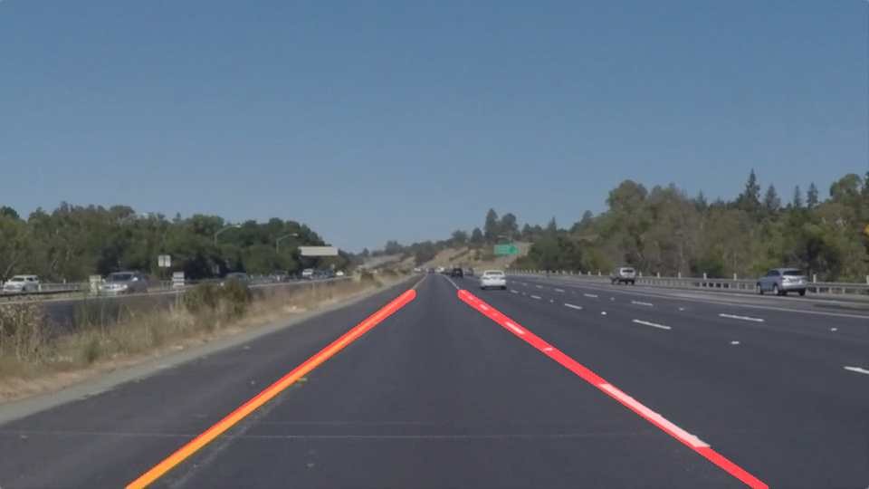

# **Project 1: Finding Lane Lines on the Road** 

The goal of this project is to construct a detector for lane lines in images/videos of roads.

It is a part of the Udacity nanodegree Self Driving Cars, term 1. 

---

### The Lane Line Detector

##### Description
The lane line detector is described in `Project Report.md`. 

##### Implementation
The lane line detector is implemented in the Jupyter notebook `Lane Line Detector.ipynb.`  

##### Example output
Example videos of the lane line detector in action can be found in the `test_videos_output` directory.
