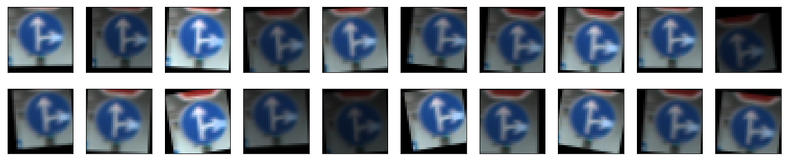
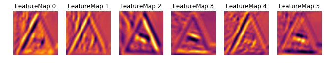

# **Project 2: Classifying Traffic Signs** 

The goal of this project is to construct a classifier of traffic signs.

It is a part of the Udacity nanodegree Self Driving Cars, term 1. 

---

### Dataset Exploration
The dataset used to train the classifier is the [German Traffic Sign Dataset](http://benchmark.ini.rub.de/?section=gtsrb&subsection=dataset). 

##### Data set split
By just inspecting the shapes of the loaded arrays, it can be determined how the dataset has been pre-divided:

| Dataset     | #Examples | 
|:------------|----------:| 
| Training    | 34799     | 
| Validation  |  4410     |
| Test        | 12630     |

Thus, about 24% is reserved as a test set, and a further 9% is used as a validation set for the model. This is a reasonable split of the examples. In total however, the examples are rather few to build a robust model. To remedy this, the training set should be [augmented](#dataset-augmentation).

##### Traffic sign images
By plotting a few random images from the dataset it becomes clear that they are stored as 32x32 images, with 3 color channels (RGB color space).

_Image data shape = (32, 32, 3)_

It is also evident that the brightness is not particularly balanced in the images. Some are very dark, others very bright. This may help to build a model robust to different lighting conditions, but can also make it difficult to classify the traffic signs using the original image. Thus, some kind of [image pre-processing](#image-pre-processing-pipeline) is essential.

##### Traffic sign classes
The classes are stored as sparsely coded vectors. To check how many unique classes there are in the testset, a Counter object is used. 

_Number of classes = 43_

| Class  | Description  | 
|-------:|:------------------------------------------------| 
|  0     | Speed limit (20km/h) |
|  1     | Speed limit (30km/h) |
|  2     | Speed limit (50km/h) |
|  3     | Speed limit (60km/h) |
|  4     | Speed limit (70km/h) |
|  5     | Speed limit (80km/h) |
|  6     | End of speed limit (80km/h) |
|  7     | Speed limit (100km/h) |
|  8     | Speed limit (120km/h) |
|  9     | No passing |
| 10     | No passing for vehicles over 3.5 metric tons |
| 11     | Right-of-way at the next intersection |
| 12     | Priority road |
| 13     | Yield |
| 14     | Stop |
| 15     | No vehicles |
| 16     | Vehicles over 3.5 metric tons prohibited |
| 17     | No entry |
| 18     | General caution |
| 19     | Dangerous curve to the left |
| 20     | Dangerous curve to the right |
| 21     | Double curve |
| 22     | Bumpy road |
| 23     | Slippery road |
| 24     | Road narrows on the right |
| 25     | Road work |
| 26     | Traffic signals |
| 27     | Pedestrians |
| 28     | Children crossing |
| 29     | Bicycles crossing |
| 30     | Beware of ice/snow |
| 31     | Wild animals crossing |
| 32     | End of all speed and passing limits |
| 33     | Turn right ahead |
| 34     | Turn left ahead |
| 35     | Ahead only |
| 36     | Go straight or right |
| 37     | Go straight or left |
| 38     | Keep right |
| 39     | Keep left |
| 40     | Roundabout mandatory |
| 41     | End of no passing |
| 42     | End of no passing by vehicles over 3.5 metric tons |
  
By plotting the distribution of different classes, it turns out that the datasets are imbalaced:

Usually, an imbalanced dataset will cause problems when training a classifier. The model will become biased towards predicting the most common classes in the training set. On the other hand, if the class distribution reflects the real distribution of how often the different signs are actually encountered in real life, it may make sense to choose the most frequent class when uncertain. Also, the imbalace seems to be roughly the same in the different datasets.

Examining the class counters reveals that the least common class has less than 10% of the examples available of the most frequent class. Interestingly, the Speed Limit 20 km/h sign is one of the rarest classes, whereas the very similar Speed Limit 30 and 50 km/h signs are among the most ubiquitous. This could prove a real challange, since very few pixels tell them apart. 

Again, data augmentation can help the classifier build features for the rare classes as well, and to avoid overfitting in general.

---

### Dataset Augmentation
The data exploration above indicated that the training set should be augmented to provide more examples of rare classes, and to create robustness against different lighting conditions, perspectives, etc. Since more real data is not available, the dataset must be extended by perturbing the original training images. 

Geometrical changes such as translation and rotation are so called [affine transformations](https://en.wikipedia.org/wiki/Affine_transformation). They maintain parallel lines in an image, and can be expressed as matrix operations. Typical examples are translation, scaling and rotation. Other perturbations may also be appropriate. The cars will encounter the traffic signs in very different lighting conditions, so brightness robustness is very important.

In this model, the following transformations will be used to augment training data:

##### 1. Brightness adjustment
To adjust brightness, the image is temporarily transformed into the [HSV color space](https://en.wikipedia.org/wiki/HSL_and_HSV). Thus, brightness can be modified randomly by scaling the V-channel value.

##### 2. Translation
Translation is applied in a random direction, but not too far, since the images are already tightly cropped around the traffic signs.

##### 3. Rotation
Rotation alters the perspective somewhat and is a good robustness builder.

##### Examples
Consider this training image:

When all three transformations are applied, a perturbed set like the one below is generated:

##### Augmented training dataset
For each image in the original training set, five perturbed images were generated and added to the training set. The class imbalance observed is thus kept, but the number of examples has been six-folded.

_Number of training examples after augmentation = 208794_

---

### Image Pre-processing Pipeline
As noticed in the [dataset exploration](#traffic-sign-images), the images have to be preprocessed to facilitate training. This section describes the pre-processing pipeline chosen for this model.

##### 1. Color space representation
Classification performance can be very dependent on which colorspace the images are represented in. Since images do not differ in color only, and many sign have similar color schemes, it should be possible to use a representation with only one color channel. This will have the benefit of reducing the number of parameters in the model. 

There are many ways of representing an image in one channel, such as the Y-channel of the [YUV color space](https://en.wikipedia.org/wiki/YUV). Here, however, gray-scaling is used:

##### 2. Contrast enhancement

Image brightness must be adjusted to properly discern some of the traffic signs. The darkest ones pose a challanges even for humans to classify. One way of improving contrast is through [Histogram Equalization](https://en.wikipedia.org/wiki/Histogram_equalization). The idea is that intensity is spread out over the complete pixel range.

Specifically, the variant called [CLAHE (Contrast Limited Adaptive Histogram Equalization)](http://docs.opencv.org/3.1.0/d5/daf/tutorial_py_histogram_equalization.html) is used. It performs histogram equalization in sub-tiles, rather than on the whole image at once. Also, noise is supressed by applying clipping to high intensities.

##### 3. Normalization

Also, pixel values are normalized to the interval [-1, 1] to improve numerical stability when backpropagating gradients. 

---

### Model Definition
The model is based on a Convolutional Neural Network (CNN), since they have shown a good performance on image classification tasks.

##### Model baseline
The classical [LeNet-5](http://yann.lecun.com/exdb/lenet/) architecture, modified to use the ReLU activation function, is used as a baseline. It has two layers of convolutions and max-pooling operations, followed by three fully connected layers. A validation accuracy of around 89% is achieved with this model.

##### Regularization
It is evident from the baseline model that overfitting takes place. The training accuracy is close to 100%. Thus, regularization is a must. To achieve this, dropout layers are added after the fully connected layers.

##### Layers
The fully connected layers are enlarged somewhat to get a more powerful classifier. 

##### Initializations
To break symmetries, weights are initialized from the truncated normal distribution with zero mean and low variance, and biases with a small positive number. 

##### Resulting model architecture
Thus, the resulting architecture becomes:

| Layer                 | Description                                   | 
|:----------------------|:----------------------------------------------| 
| Input                 | 32x32x1 image                             | 
| Convolution 5x5       | 1x1 stride, valid padding, output 28x28x6     |
| ReLU activation       |                                               |
| Max pooling           | 2x2 stride,  output 14x14x6                   |
| Convolution 5x5       | 1x1 stride, valid padding, output 10x10x16    |
| ReLU activation       |                                               |
| Max pooling           | 2x2 stride,  output 5x5x16                    |
| Fully connected       | input 400, output 512                                          |
| ReLU activation       |                                               |
| Dropout               |                                           |
| Fully connected       | input 512, output 256                                          |
| ReLU activation       |                                               |
| Dropout               |                                           |
| Fully connected       | input 256, output 43                                          |
| Softmax               | Class probabilities output                                          |

Other architectural variants that have been proposed by e.g. [Yann LeCun et al.](http://yann.lecun.com/exdb/publis/pdf/sermanet-ijcnn-11.pdf), such as connecting the outputs from the first max pooling layer to the first fully connected layer was tried without significant improvements (at least in combination with other design choices). See also [Future Improvements](#future-improvements) for a discussion on how the architecture can be modified even further to perhaps improve classification performance.

---

### Model Training

##### Hyperparameters
After trying different combinations of hyperparameter values, the model was eventually trained with the `Adam Optimizer` for `50 epochs`, using `batch size = 256` and `learning rate = 0.001`. For regularization layers, `dropout = 0.5`. 

---

### Model Evaluation

##### Accuracies
After completed training, the classification accuracy is calculated for all datasets:

| Dataset     | Accuracy  | 
|:------------|:----------| 
| Training    | 99.7%     | 
| Validation  | 98.4%     |
| Test        | 96.4%     |

Thus, the effects of class imbalance did not affect the classification performance too much.

##### Overfitting
As can be seen in the accuracy figures, the model still exhibits slight overfitting, although much less than the baseline model does. Further regularization and/or data augmentation should be applied to push this down even further.

##### Extra test image classification performance
Besides the given test set, five random images were downloaded from the internet, scaled down to 32x32, and cropped around the traffic sign:

The first image has the potential challenge of having completely different backgrounds along the different edges of the sign. Image number two is partly blocked by a man. In the third image, there is a noisy brackground - including shapes and colors similar to the actual sign. The fourth image has mostly thin lines differentiating it from some other signs. The Speed Limit 30 km/h sign in the fifth image is easily confused with similar signs, e.g. Speed Limit 50 km/h and 80 km/h.

When running these images through the pre-processing pipeline and then through the classifier, the correct class is predicted in 100% of the cases! This is in line with the test set performance, but it was not a given that the classifier would be robust to all the challenges.

But how certain is the model of those predicitions? To check that, the top-5 class probabilities are extracted:

The model is very sure of its answers. If fact, for three of the signs it is 100% sure! The most "uncertain" predicition is 99,97% (for the Road Work sign). Thus, the model seems to have reasonable robustness and generalization capabilities.

##### Misclassified images
To get further insight into the model performance, some misclassified images from the test set are plotted:

Several of the hard exmaples have glares and other artefacts across the traffic signs. Other are very blurry. Image processing could perhaps be improved to correctly classify them as well.

When plotting the class distribution of misclassifications, it turns out that the top three classes that the model confuses are:
  * General Caution  
  * Speed Limit 80 km/h  
  * Beware of Ice and Snow  

##### Confusion matrix
Even more details about the model can be found when examining the confusion matrix (see Jupyter Notebook for a plot). For instance, the _Traffic Signals_ sign is often confused with _General Caution_. Maybe not too unexpected given the examples below?

---

### Neural Network State Visualisation
It is also instructive to visualize what the activation of the convolutional layers look like when fed an image:

##### Slippery Road

##### Speed Limit 30 km/h

Thus, the network has learnt to detect the sign shape and symbols. At the lower level, edges that make up the signs can be discerned.

---

### Future Improvements

##### Dataset extension
Data augmentation helped a lot with model robustness and to limit overfitting. Adding more training examples should be able to improve this even more. New affine transformations, such as shearing or flipping (where possible), should be investigated, as well as other techniques, like adding noise to the images.

##### Image pre-processing
A more sophisticated image pre-processing will almost certainly be able to increase classification performance even further. Alternative color space representations and normalization techniques would be interesting to play around with. Adding other pre-processing steps would also be helpful. Maybe adding an edge emphasizer? 

Investigating the misclassifications and the confusion matrix more deeply may give hints on what steps to add/change/remove.

##### CNN Model
There are several obvious ways in which to modify the CNN architecture that should be explored. Adding more convolutional and fully connected layers can be beneficial (if the dataset is augmented further to combat overfitting). Layer details like kernel and stride sizes may also be worth tweaking. Other CNN architectures (e.g. ResNet) possibly outperform LeNet-5 on this task as well.

A grid search should be performed to find the optimal combination of hyperparameter values.

More regularization could be added to the weights in the fullty connected layers, e.g. L2 or MaxNorm, to push the validation accuracy even closer to the training accuracy. 
