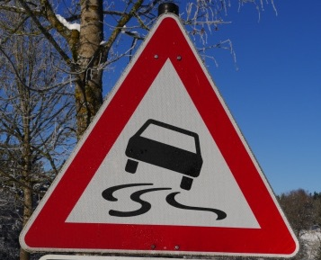

# **Project 2: Classifying Traffic Signs** 

The goal of this project is to construct a classifier of traffic signs.

It is a part of the Udacity nanodegree Self Driving Cars, term 1. 

---

### The Traffic Sign Classifier

##### Description
The traffic sign classifier is described in `Project Report.md`. 

##### Implementation
The traffic sign classifier is implemented in the Jupyter notebook `Traffic_Sign_Classifier.ipynb`.
