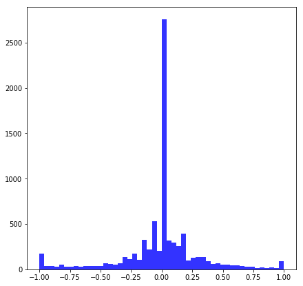

# **Project 3: Behavioral Cloning** 

The goal of this project is to teach a simulated car to drive autonomously around a set of race tracks.

It is a part of the Udacity nanodegree Self Driving Cars, term 1. 

---

### The Car Simulator
The steering angle and throttle of the car can be controlled through an API. In this project, the throttle is automatically regulated to keep the speed constant. Thus, only the steering angle needs to be predicted by the model.

##### Car setup
The car has three cameras positioned in the front windshield, one to the left, one in the center and one to the right:

##### Race tracks
The car simulator has two tracks. The _Lake track_ which is flat and only moderately curved, and the _Jungle track_ which is more challenging, with hills to drive up and down, as well as several sharp turns.

##### Simulator modes
The car simulator can be run in _Training mode_ to collect data. The user controls the car around the track, and images from all three cameras, along with corresponding values of the steering angle, throttle, break and speed are recorded to file.

In _Autonomous mode_, the car is steered through the API. This mode is used to evaluate the model. Only the images from the central camera is available as telemetry, which will affect model design.

---

### Dataset Exploration

##### Dataset collection
A sample dataset was provided by Udacity. It contains `8036` examples, and has been collected on the Lake track by driving in the middle of the road for a few laps. 

Given that the Jungle track is so much more demanding, there is very little hope of being able to generalize ability to drive both tracks autonomously by only training on Lake track data. Therefore, a single lap of training data was collected from the Jungle track as well. Extra recordings of driving the sharpest turns was also added. The Jungle track collection was made by controlling the car through the keyboard, which makes the driving somewhat sketchy and not ideal for training. Still, it gives the model a flavor of how to drive in hilly country and along more intense trajectories.

In total, the number of training examples is `12450`. This is still a very small dataset to train a deep learning model, so [data augmentation](#dataset-augmentation) will be necessary to avoid memorization of the training data.

##### Dataset visualization

Some sample images from the dataset, with associated steering angles, can be seen below:

The images are stored in the RGB colorspace. It is also interesting to note some further differences between the images from the two tracks. Besides different lighting conditions and road color/texture, the Jungle track has a center line in the road, whereas the Lake track does not. This can prove challenging for the model, since all data was collected while driving in the middle of the road. Cloning this behaviour would mean staying _between_ the road borders ("lines") on the Lake track, but _following_ the center line in the Jungle track. Quite confusing. It would perhaps make more sense to collect Jungle track training data by driving in one of the lanes instead, but this was not done due to the difficulty of collecting such data using the keyboard.

Another informative plot is the distribution of steering angles:

Two important conclusions can be drawn. First of all, there is a huge over-representation of `steering angle = 0.0`. Naturally, this follows the disposition of the tracks, but it can make the model too biased towards driving straight ahead.

Secondly, even though Lake track training data encompasses driving in both directions, there still seems to be a slight left turn bias. This should be evened out. See section on [image pertubations](#image-perturbations) below for more information on dealing with bias issues.

---

### Dataset Preparation

##### Bias reduction
First of all, the steering angle biases should be reduced. A random 50% of `steering angle = 0.0` examples are dropped. The new steering angle distribution becomes:

### Dataset Augmentation
The undersamling performed to reduce steering angle bias above, has further reduced the already few training examples. Thus, it is even more important to augment the dataset.

##### Recovery examples
As noted before, only the center camera feed is available in autonomous mode. However, by compensating the steering angles, the side camera images can also be used in training. Interpreting the side camera images as coming from the center camera will have the same effect as driving closer to the edge of the road. This implies that the added examples are especially useful to teach recovery actions:

 

The steering angle `a` can assume values [-25, 25] degrees. In the simulator, the angle is normalized to [-1, 1]. To compensate the steering angle to be reasonable for side camera images, the correct way would be to use trigonometrical calculations. As a simplification however, it is assumed that the shift is a constant `0.25` (a hyperparameter of the model). After adding the side camera examples, the dataset has grown to `23451` examples. Still very few examples in total.

##### Image perturbations
To further augment data, and at the same time improve model robustness, image perturbations will be generated. In this way, the dataset can be extended substantially, and the model can not just memorize the training examples. Three strategies will be employed: flip, brightness modification and translation.

The strategy to balance left and right turn data will be to randomly flip the images (and consequently invert the corresponding steering angles). 

Brightness should be randomly modified as well, since it was noted that brightness seems to vary along and across tracks. To accomplish this, the image is temporarily transformed into the [HSV color space](https://en.wikipedia.org/wiki/HSL_and_HSV). Thus, brightness can be modified by scaling the V-channel value.

Finally, translating the images in random directions will produce more examples. Of course, horizontal translations require a compensation of steering angle. Again, a very non-scientific approach to estimating the altering factor was made. The image shift between left and right cameras roughly corresponds to a horizontal translation of about 15 pixels (in the _cropped_ image sent to the neural network, see [below](#image-transformation-layers)): 

Since the angle compensation for the side cameras was set to a constant (see [recovery examples](#recovery-examples) above), we continue this simplification and set the translational compensation to about `0.033` (2*0.25/15) per pixel.

An example set of perturbed images looks like this:

---

### Model Definition
The model is based on a Convolutional Neural Network (CNN), since they have shown a good performance on image classification tasks. 

##### Model baseline
For this project, the starting point was chosen to be the [Nvidia DAVE-2 architecture](http://images.nvidia.com/content/tegra/automotive/images/2016/solutions/pdf/end-to-end-dl-using-px.pdf). It has been used for similar tasks in the real world. 

##### Image transformation layers
The camera images are captured with `size = (160, 320, 3)`. As evident from the example images above, the road does not occupy the whole image, so it can be cropped in the vertical direction. To improve processing speed, the image is also scaled down by a factor 2. As usual, image pixel values are normalized to improve numerical stability when backpropagating gradients.

These layers are added inside the model (as lambda layers), to quickly apply the same transformations on the live camera feed.

##### Convolutional layers
The DAVE-2 model has five layers of convolutions (without pooling), followed by three fully connected layers. For this toy example, however, the first (strided) convolutional layer was removed to get a slightly smaller model.

##### Regularization
Even with data augmentation, it is important to take precautions to avoid overfitting. Dropout layers as well as L2-regularization was added to the fully connected layers, but not to convolutional layers. More than 80% of the parameters belongs to the first FC-layer, so it makes most sense to add it there. 

##### Initialization
The model uses the KERAS defaults for weight initialization (i.e. [Glorot](http://proceedings.mlr.press/v9/glorot10a/glorot10a.pdf)).

##### Resulting model architecture
Thus, the resulting architecture becomes:

| Layer                 | Description                                   | 
|:----------------------|:----------------------------------------------| 
| Input                 | 160x320x3 image                               | 
| Cropping              | 80x320x3 image                                | 
| Resize                | 40x160x3 image                                | 
| Normalization         | 40x160x3 image                                | 
| Convolution 5x5       | 2x2 stride, valid padding, output 18x78x36    |
| ReLU activation       |                                               |
| Convolution 5x5       | 2x2 stride, valid padding, output 7x37x48     |
| ReLU activation       |                                               |
| Convolution 3x3       | 1x1 stride, valid padding, output 5x35x64     |
| ReLU activation       |                                               |
| Convolution 3x3       | 1x1 stride, valid padding, output 3x33x64     |
| ReLU activation       |                                               |
| Fully connected       | input 6336, output 100                                           |
| ReLU activation       |                                               |
| Dropout               |                                           |
| Fully connected       | input 100, output 50                                          |
| ReLU activation       |                                               |
| Dropout               |                                           |
| Fully connected       | input 50, output 10                                          |
| ReLU activation       |                                               |
| Dropout               |                                           |
| Fully connected       | input 10, output 1                            |

---

### Model Training

##### Data set split
20% of the dataset is reserved as validation set to tune hyperparameters. No test set is created. Instead, simulator driving performance will be used to evaluate the model.

##### Loss function
The model shall predict the steering angle of the car, so it makes sense to use Mean Square Error (MSE) between the predicted and given steering angle as the loss function to minimize. 

##### Hyperparameters
After trying different combinations of hyperparameter values, the model was eventually trained with the `Adam Optimizer` for `50 epochs`, using `batch size = 512` and `learning rate = 0.0002`. 

For regularization layers, parameters are set according to: `dropout = 0.5` and `l2-lambda = 0.001`. 

---

### Model Evaluation

##### Overfitting
The training history plot shows how the loss of the training set and validation set varied over the epochs:

The loss function wobbles a bit, which is expected, considering that images in the datasets are perturbed in different ways in each epoch. Since losses are calculated over the complete sets, and the data was split 80/20, the MSE should be significantly lower for the validation set. If the training set MSE should become lower the the validation set MSE at some point, it is a sign of overfitting. Here though, the validation loss is consistently lower that the training loss. As an additional measure, the number of epochs can probably be reduced ("early stopping"), given the flatness of the loss curve in later epochs. However, 50 epochs were kept, since small improvments could still be seen in the stability of the car.

##### Track performance 
The car drives comfortably around the Lake track, even at full speed. It is also capable of driving the Jungle track at a slightly lower speed. See the __videos__ for details.

Sometimes, the car seems confused if it should drive in the middle of the road or in a lane on the Jungle track, but it still performs better than expected given the center line (as discussed in [dataset exploration](#dataset-visualization)). Also, at full speed, the car wobbles back and forth at times. Probably due to the drop of some zero angle examples, or perhaps the steering angle correction simplifications?

---

### Future Improvements

##### Data collection
To improve generalization capabilities, more training data should be assembled. Only one lap was gathered from the most challenging track, this set should be appended with more laps. It would also make sense to collect data from the Jungle track when the car stays in one lane as much as possible, to be more consistent with the Lake track images. A better controller than the keyboard would be necessary to gather this kind of data.

##### Image perturbations
More or different image perturbations will probably improve driving performance as well. When running the simulator in higher resolutions, shadows are added to the track. The current model can not handle this correctly. To overcome the issues here, brightness adjustments can be tuned, and some kind of shadow simulation should be added to the image perturbations.

##### Steering angle corrections
A more stringent method of calculating steering angle compensations from side cameras and horizontal image translations will probably improve driving precision, and potentially reduce wobble.

##### CNN Model
Not too much time was spent on playing around with the DAVE-2 architecture. It can probably be tweaked further in this application. Performance of other CNN architectures should also be compared to the one chosen. It would also be interesting to investigate how driving performance vary with model size. 

A grid search should be performed to find the optimal combination of hyperparameter values.

##### Model evaluation
It would be very interesting to evaluate performance on a completely unseen track to better judge generalization capabilities!
