# **Project 4: Advanced Lane Finding** 

The goal of this project is to detect and visualize lane lines in videos of roads.


It is a part of the Udacity nanodegree Self Driving Cars, term 1. 

---

### Camera calibration
The camera of the car projects 3D objects in the real world onto a 2D image plane. In the process however, the shape of the lens causes object distortion. It is important to correct for these effects.

##### Distortion
The major types of distortion effects are radial and tangential. Radial distortion stretches images due to lens curvature, especially at the edges. Tangential distortion is caused by an unalignment between the lens and imaging plane. It causes images to look tilted horizontally and/or vertically.

The distortion effects of a particular camera can be described with a set of coefficients: (_k1, k2, p1, p2, k3_). To determine the values of the distortion coefficients, chessboard images are used: 

{width=75%}

The high contrast pattern is perfect for automatically detecting points in the image, and it is also easy to tell what a successfully undistored image should look like. The corners in the image are used as mapping points. Corners are defined as intersections of two black and two white squares. Thus, as can be seen in the example image above, the chessboard contains 9x6 corners.  

##### Calibration procedure
The mapping between object points (OP) and image points (IP) can mathematically be described as:

```
OP(x, y, z) = C*IP(x', y')
```

_C_ is called the camera calibration matrix. By postulating that the chessboard in the real world is placed in the plane _z=0_, the object points become the same for all calibration images: (_x, y, 0_). Furthermore, origo of the (_x, y_)-coordinate system is defined as the top left corner, with _x_ increasing to the right and _y_ downwards.

In object space, corners are placed at integer coordinates (1, 1), (2, 1), ..., (9, 6). An automatic corner detection function is used to determine the corner coordinates in image space:

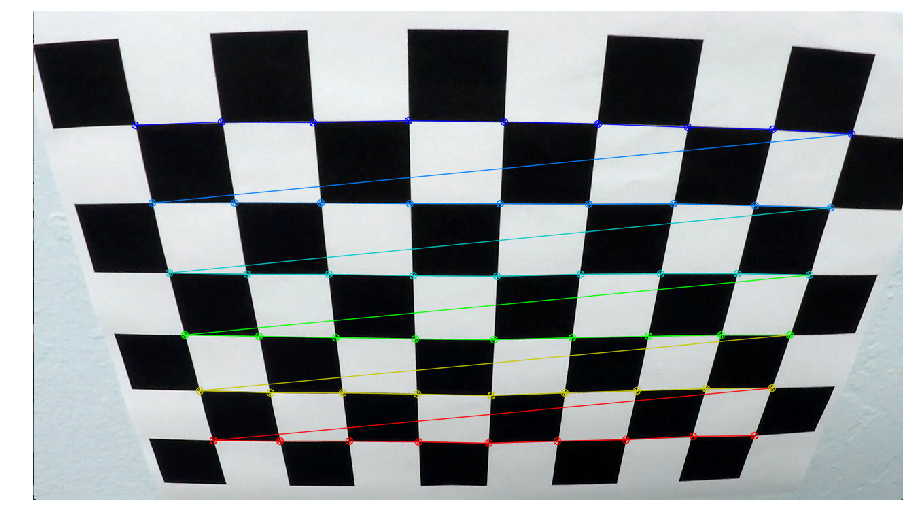{width=75%}

With the mapping between object points and image points established, the camera calibration matrix and distortion coefficients can be calculated. In the set of 20 calibration images available, three images do not display all corners. They are discarded from the calibration procedure, since 17 out of 20 is good enough.

##### Undistortion

Given the camera calibration matrix and distortion coefficients, images can be undistorted:

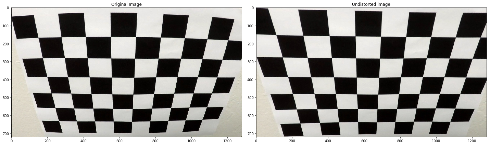

---

### Image Filters
A set of filters must be constructed to isolate lane lines in the undistorted camera images.

##### Test images
To configure the image filters, a set of test images from the project video was available:

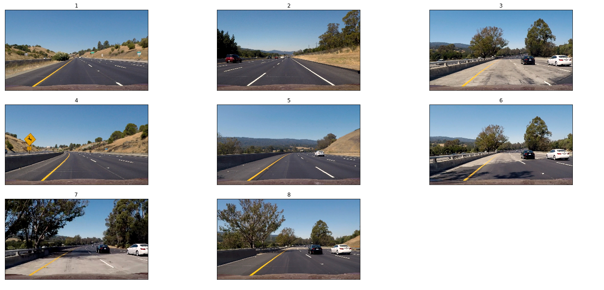

Apart from some brighter sections of tarmac and the occasional shadow however, conditions are far to similar for a robust filter design. Therefore, the test set was resampled from the different videos available:

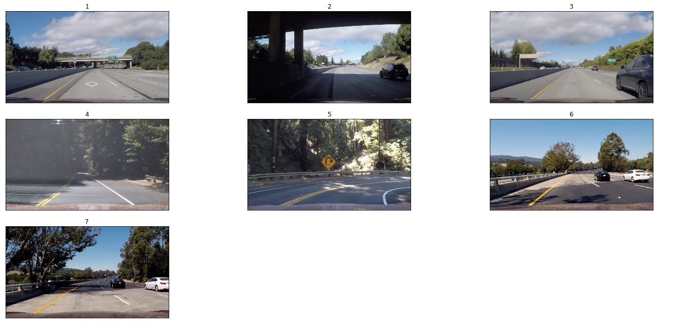

While keeping the challenges in the original test set (image 6 and 7), several new difficulties are added. Tarmac patching producing prominent "ghost lines" with similar position and direction (image 1), poor lighting conditions (image 2 and 4), poor contrast (image 3), and sharp turns (image 5). 

##### Region of interest

Some filters are rather noisy, so a (rough) mask will be applied to get rid of some artifact that are not lane lines.

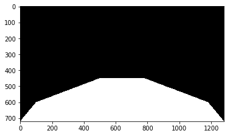

### Color filters
The most obvious way to pick out lane lines is to filter images based on color.

##### Image contrast
Contrast between tarmac and lane lines can sometimes be poor in the images. To enhance the contrast in preparation for color filtering, [histogram equalization](https://en.wikipedia.org/wiki/Histogram_equalization) is performed as a pre-processing step. 

##### Colorspace representation
To facilitate lane line identification by color, it is key to choose a good colorspace representation. Ideally, the representation shall separate lines clearly, as well as be reasonably robust against varying lighting conditions in the image. Also, different filters are needed for white and yellow lines, respectively. 

After investigation of the channels in a number of different colorspaces, it becomes clear that the B-channel in LAB-space and the V-channel in YUV-space are most promising to pick out yellow lines. The V-channel was chosen, since it performs marginally better (but still unsatisfactory) in very dark conditions, such as in image 2, taken while driving under an overpass:

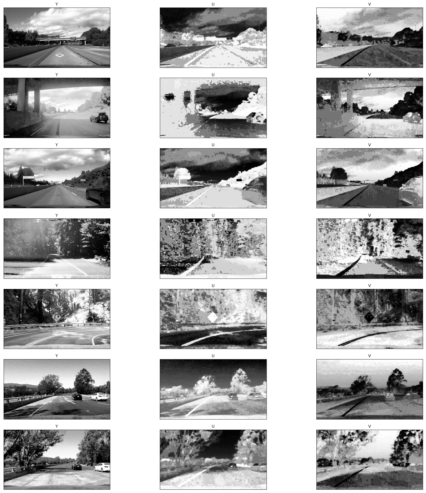

White lines are best represented in an L-channel, e.g in LAB-space:

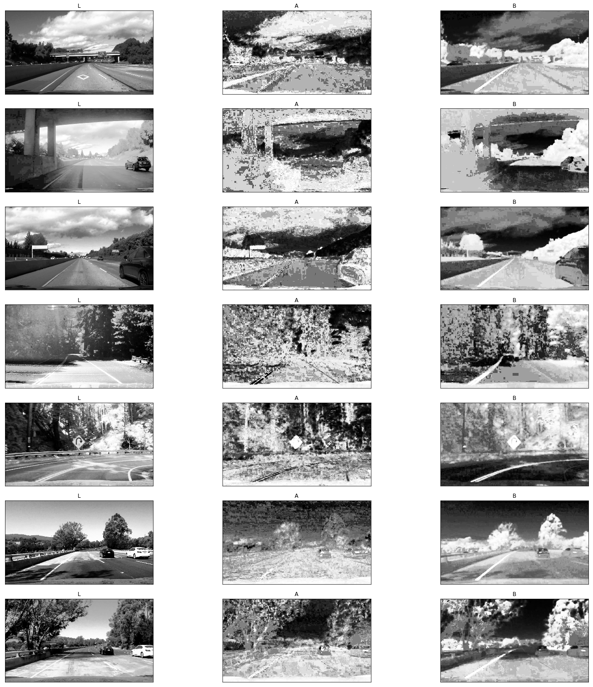

It is not ideal however, since in bright conditions many objects will have a high lightness value.

##### Filter thresholds
After trading off identification of lane line pixels and noise in the test images, the filter thresholds were tuned to: 

| Filter          | Thresholds  | 
|:----------------|:------------| 
| V-channel (YUV) | (0, 20)     | 
| L-channel (LAB) | (248, 255)  | 

The filters are combined (within the [region of interest](#region-of-interest)) to yield the following masks in the test images:

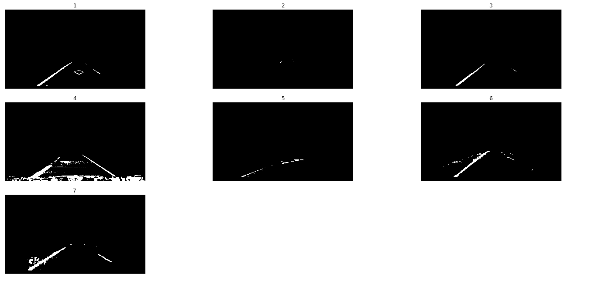

The trade-off is evident, almost all lane pixels are filtered out in the dark image 2, whereas others still contain noise. This illustrates the difficulty of identifying a single threshold that generalizes to all conditions. See [Future Improvements](#future-improvements) for further discussions regarding this.

In the original test set it looks better, except some extra noise in image 3 and 7:

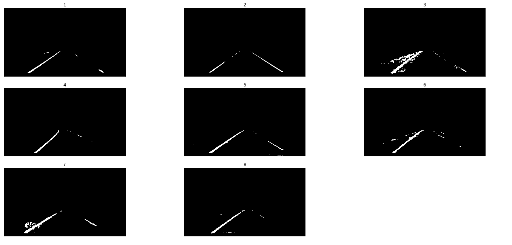

### Edge detection filters
Another way of attempting to identify lane lines is to use edge detection filters. 

##### Sobel operator
There are various ways of detecting edges in an image, for instance to calculate image gradients. By applying the [Sobel Operator ](https://en.wikipedia.org/wiki/Sobel_operator), approximate derivatives are calculated by convolving the image with a kernel, one in the horizontal and one in the vertical direction: 

```
     [-1 0 1]         [-1 -2 -1]
Sx = [-2 0 2]   Sy =  [ 0  0  0]
     [-1 0 1]         [ 1  2  1]
```

The horisontal operator _Sx_ can be more effective to detect lane lines, since in most cases, the lines have a stronger vertical than horizontal signal in the images. Also, the absolute value of the result is used, because both dark-bright and bright-dark transitions are equally valid as potential lane lines.  The magnitude and direction of the gradient can also be useful for thresholding purposes:

```
Magnitude = sqrt(Sx^2 + Sy^2)

Direction = arctan(Sy/Sx)
```

##### Filter thresholds
While gradient filters can be more robust to varying lighting conditions, they have big problems with ghost lines as obvious in the image below:

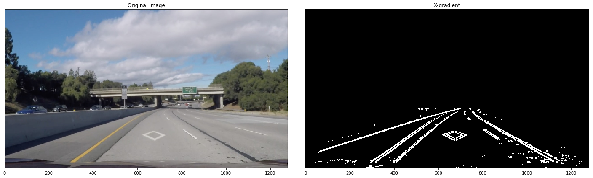

Furthermore, since the ghost lines have similar direction and possibly magnitude, it is very difficult to pick out the correct lines with thresholding. Therefore, gradient filter will not be used in this lane detector.

---

### Perspective Transformation
It is very hard to determine lane curvature when lane line points are not equidistant to the camera. To alleviate this, camera images are transformed to a bird's-eye perspective. This is done in a similar way to camera calibration, with a calibration polygon. 

To facilitate lane curvature calculations, as well as being able to validate the perspective transform, an image where the lane lines are as straight as possible is used. In the bird's-eye perspective, the lines should be perfectly parallel (assuming that the road is flat in the image).

The source polygon traces the lane lines (with the hood of the car avoided), and the destination polygon maps those to the middle of each half plane, i.e. at 25% and 75% of the image width, respectively:

| Source points   | Destination points  | 
|:----------------|:--------------------| 
| (260, 680) | (320, 720)  | 
| (580, 460) | (320,   0)  | 
| (700, 460) | (960,   0)  | 
| (1050, 680) | (960, 720) | 

The resulting transformation becomes:

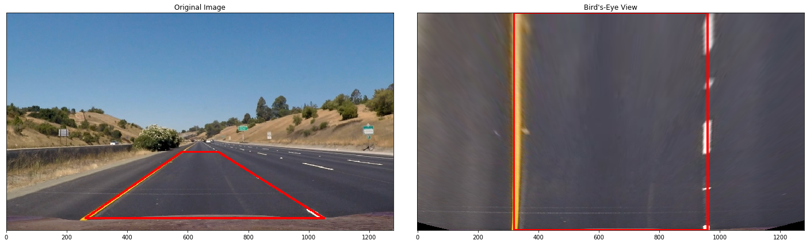

Applying the transformation on the original test set, the result is:

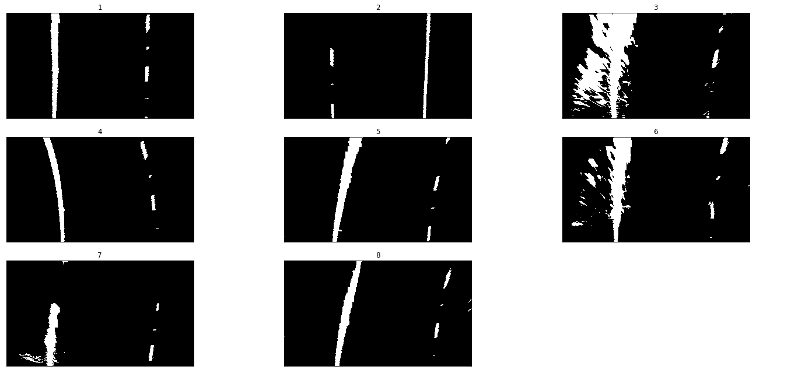

One thing to note is that pixels near the top of the image get "smeared out" due to the shape of the calibration polygon. The lane detector needs to take this into account, such that the noise in e.g. image 3 is not classified as lane line pixels. 

---

### Lane Detection
Lane lines are more or less isolated and parallel in the filtered bird's-eye perspective camera images. Thus, they are ideal to create a robust lane line tracker. 

##### Histogram analysis
To find where the lanes start, a histogram of the image is created. Since the perspective transform "smears out" the pixels near the top of the image, the top half of the image is not taken into account when the histogram is generated. Pixel values are summed column-wise, yielding that the highest peak in each half-plane of the histogram should correspond to the x-value of the lane lines: 

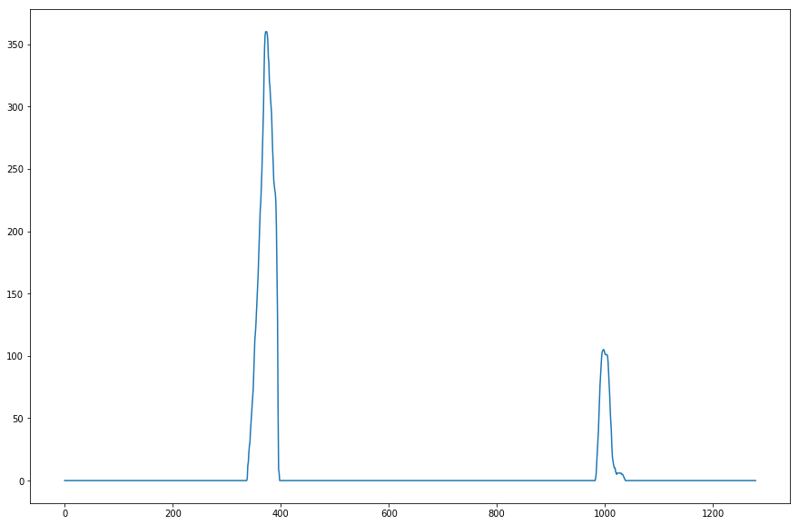{width=50%}

##### Lane tracking
With starting points found, the lane lines can be tracked through the image. Two different methods are used for this, _sliding windows_ and _polynomial tracking_. A 2nd degree polynomial is then fit to all pixels found by the trackers to give a convenient lane representation:

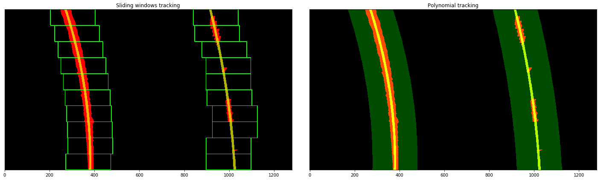

When no previous line detection exists, the _sliding windows_ method is used to track the line. A small window is formed around the starting point given by the histogram analysis. All non-zero pixels within the window are taken to be part of the lane line. A new window is then created on top of the previous one and recentered around the mean of the detected pixel cloud. The process is repeated until the top of the image is reached. 

_Polynomial tracking_ is used when the line already has a polynomial representation from a previous frame. Since the lane lines do not move much from one frame to another, lane pixels can be expected to be found close the already established polynomial fit. Thus, pixels within a marign around the polynomial are deemed to be lane line pixels. A new polynomial is then fit to those pixels.

##### Tracking robustness
To increase robustness against lingering noise in the image, or frames where lane lines are hard to identify, some simple sanity checks are performed before detected pixels are considered as parts of an actual lane line. For instance, a minimum number of pixels must be detected, and they must be observed in several different windows. The resulting polynomial fit is also averaged over multiple frames, and the coefficients of new fits are checked to be within a reasonable variation around the averaged fit. 

##### Lane visualization
When stable polynomial fits of the lane lines have been established, they are plotted and transformed back onto the original perspective.

---

### Lane metrics
The bird's-eye view also facilitates the calculation of some lane metrics.

##### Curvature
The curvature of the lane is useful to determine proper steering angles for autonomous cars. The radius of curvature can be derived using the polynomial fit and the following [formula](https://en.wikipedia.org/wiki/Radius_of_curvature#Formula):

```
Polynomial fit:      f(y) = Ay^2 + By + C

Radius of curvature: R = ((1 + (2Ay + B)^2)^3/2) / |2A|    
```

In this lane finder, the lane curvature is defined as the mean of the curvatures calculated for the two averaged polynomial fits. Since the polyonimals were fit in pixel space, they must be converted to real world coordinates to be useful. To do the conversion, a lane is assumed to be about 30 meters long and 3.7 meters wide (which is the minimum lane width according to U.S. regulations).

##### Car offset
Assuming that the camera is mounted in the middle of the car, it is also possible to calculate the position of the car in relation to the center of the lane:

```
Car offset:  pos = ((left_x + right_x) / 2) - lane midpoint
```

Again, the result is converted from pixel space to real world values and displayed in the image.

---

### Full pipeline

In summary, each image is processed according to the following pipeline:

1. Undistort image
2. Filter image
3. Transform image to bird's-eye perspective
4. Detect lane lines in image
5. Fit polynomial to detected lane lines
6. Plot lane lines
7. Calculate lane metrics
8. Transform perspective back to original

An example of the result is shown below:  

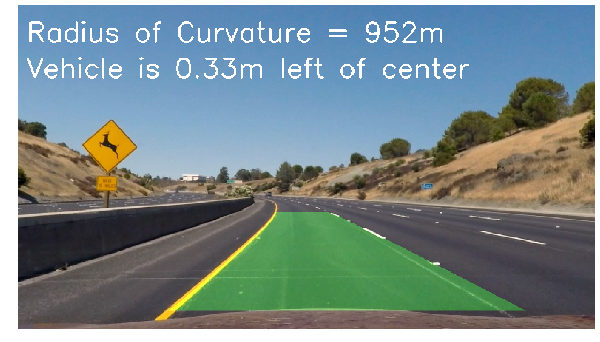{width=75%}

##### Video performance
The pipeline has been verified to perform well on the [project video](test_videos_output/project_video.mp4). It also does a pretty decent job on a more challenging [video](test_videos_output/challenge_video.mp4), with ghost lines and an overpass.

There is however an additional video, where the car drives on a very curvy forest road. In those conditions, the lane detector still struggles. See [Future Improvements](#future-improvements) for some thoughts on how to tackle this.

---

### Future Improvements

##### Image filtering
The most critical issue to get a robust lane line detector is image filter design. For instance, gradient filtering seemed promising, but turned out to be rather unrobust with a lot of false positives. The color filters do a better job, but still struggles in very dark conditions. Thus, better equalization of lighting conditions is crucial. After spending quite some time on filter tuning, it is obvious that a filter ensamble would be necessary to deal with all conditions. Either different filters are run in parallel and weighted together, or masks are created to pick which filter to apply in which regions of the image.

##### Perspective transformation
The bird's-eye perspective transform also fails for very sharp turns: 

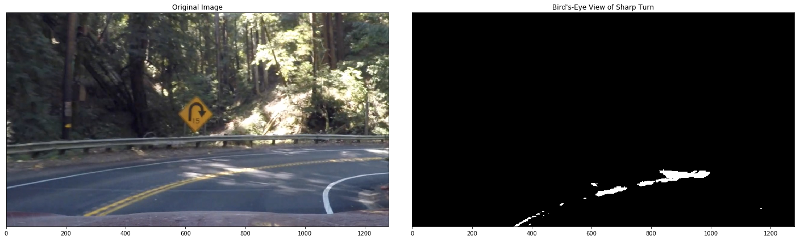{width=75%}

For lane tracking to work in these cases, the perspective transform also has to be adaptive in some way. The region of interest mask that is applied in the image filtering process also eliminates some lane pixels, as evident in the example above. 

##### Lane detection
Extra robustness was gained by averaging the polynomial fits over several frames. This assumes that the lane lines vary slowly, which is not the case in the forest road video. Again, some adaptation scheme is needed. Instead of smoothing, the lane detector needs to rely on sliding window tracking in each frame when the road is undulating heavily. Moreover, the sanity checks applied to calculated fits could be extended to further increase the precision of ploynomial fits.
