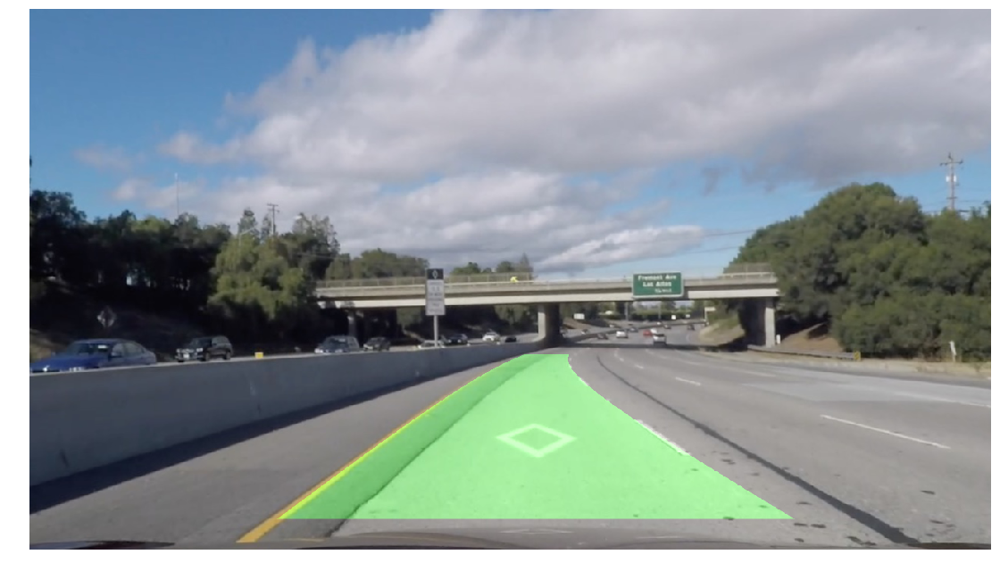

# **Project 4: Advanced Lane Finding** 

The goal of this project is to detect and visualize lane lines in videos of roads.

It is a part of the Udacity nanodegree Self Driving Cars, term 1. 

---

### The Lane Line Detector

##### Description
The lane line detector is described in [Project Report.md](./Project_Report.md). 

##### Implementation
The lane line detector is implemented in the Jupyter notebook [Advanced Lane Finding.ipynb](./Advanced_Lane_Finding.ipynb).

##### Example output
Example videos of the lane line detector in action can be found in [this directory](./test_videos_output).