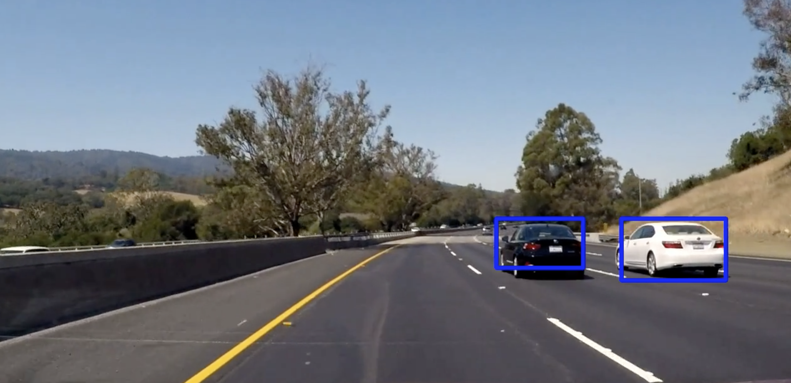
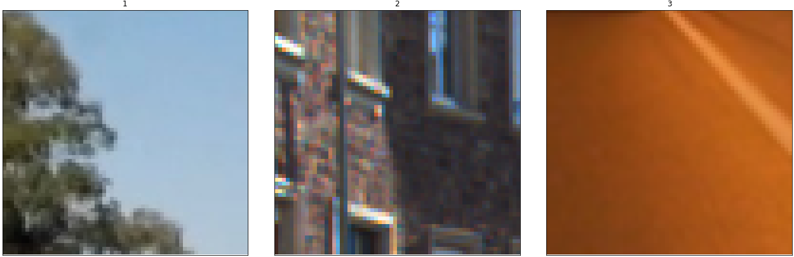

# **Project 5: Vehicle Detection and Tracking** 

The goal of this project is to detect and track vehicles on the road. It forms a basis for planning the steering actions of an autonomous car.



It is a part of the Udacity nanodegree Self Driving Cars, term 1.

---

### Vehicle Detector
The autonomous car has a camera mounted in the windshield. To plan steering actions, one pre-requisite is to keep track of where other vehicles are located and to anticipate their movements. In order to detect vehicles in an image, it is necessary to build a classifier that can discriminate an image patch into the classes vehicle/non-vehicle:




Vehicles can be detected by a sliding a small window across the camera image and feed them to such a classifier. The dataset contains image patches of size 64x64 pixels.

##### Colorspace representation
Since vehicles can have different colors, it is important that features are color invariant. This is intuitively hard to achieve in RGB colorspace, since e.g. a red and a blue car have very different spectra. To facilitate separation of vehicles from non-vehicles, a more suitable colorspace must be chosen. Plotting image patch pixel intensities in 3D space (one channel in each dimension), can reveal better options where pixels are more collected. Using the three image patches of cars with different colors above, the invariance capacity can also be judged.
 
After investigation of a number of different colorspaces, it becomes clear that a luma/chroma system like YUV or YCrCb seems most promising for collecting car pixels. In YCrCb-space, pixel intensities have the following distributions:


Plotting the non-car images in YCrCb also display collected intensities, as well as a separation from the intensity clouds of car patches:


Moreover, YCrCb seems to have a marginally wider separation between the categories than YUV, at least for the test images. Thus, YCrCb is chosen as the most promising colorspace to work with color features.

### Feature Design

##### Binned color intensities
Using raw pixel intensities is not robust to differences in attributes such as form, orientation and size. Intensities can however still be useful as complementary features. One issue to consider is that the raw intensities vector is rather high-dimensional, even for small patches (64\*64\*3=12288). To reduce the feature vector size somewhat, the patch can be subsampled using spatial binning:


The pixel intensity signature can be compressed a lot and still be useful. At 8x8, things are getting a bit difficult to discern. 32x32 is chosen to keep feature vector size reasonable. Plots of the resulting vector of YCrCb channels for the test images are shown in the figures below:


These (admittedly few) examples exhibit different patterns, which seems to justify the inclusion of the spatially binned intensities in the feature vector.

##### Color histograms
Color histograms are robust to variations in aspect and orientation of the object, and thus another good candidate for data to include in the feature vector. The YCrCb histograms for the test images are plotted below, with different bin sizes:


The histogram bin size is set to 32 to maintain reasonable descriptability. 

##### Histogram of Oriented Gradients (HOG)
Besides color features, gradient-based features can be also be considered. One such concept that has proven useful for object detection is the [Histogram of Oriented Gradients (HOG)](https://en.wikipedia.org/wiki/Histogram_of_oriented_gradients).

Briefly, HOG features are constructed by computing the gradient magnitudes and orientations in each pixel. They are grouped into small cells, e.g. 8x8 pixels. Within each cell, a histogram of gradient orientations is created. Instead of just binning gradient orientation counts however, gradient magnitudes are used to weight the contribution of each pixel. In this way, noise is suppressed. The resulting feature vector provides some robustness to variations in object shape. To enhance performance even further, intensities are usually normalized across blocks of cells. A visualization of the HOG features of each YCrCb channel:


It is not trivial to configure the HOG parameters. As a rough guide, cell size is chosen similar to the size of distinguishing features of the object to detect. Even fitting a classifier to different combinations of parameter configurations was not decisive, since several combinations yielded similarly high validation accuracies, but still performed differently on real camera images. Thus, empirical testing resulted in the parameter configuration 9 orientation bins, 8 pixels per cell and 2 cells per normalization block. All color channels of YCrCb space are used.

##### Total feature vector
In summary, the feature vector was constructed as a combination of the three methods - binned color intensities, color histogram and HOG. All parts are generated from the camera image represented in all channels of the YCrCb colorspace. The size to the total feature vector is `32*32*3 + 32*3 + 7*7*2*2*9*3 = 8460`.

---

### Patch Classifier
A classifier of image patches into cars/not cars can be constructed with the feature vector described above as input.

##### Feature normalization
The [feature vector](#total-feature-vector) is a concatenation of several different components, and thus includes features of different scales. Therefore, it is imperative to normalize the feature vector to make sure the classifier make optimal use of all available information. In this case, standardization (i.e. subtracting the mean and scaling each feature to unit variance) was chosen as scaling method. An example of the feature scaling is shown below:


##### Class imbalance
The provided dataset is roughly balanced, but not huge - about 9000 examples per class. The balance is kept even after splitting data into a training set and a test set.

##### Classifier
In the spirit of Occam's Razor, the dataset is initially given to a simple classifier - a [Support Vector Machine (SVM)](https://en.wikipedia.org/wiki/Support_vector_machine) with linear kernel. The SVM is usally effective when the number of examples are in the same order as the feature vector dimension, such as in this case. 

##### Hyperparameters
The linear SVM is regularized with the parameter `C`. To find the optimal C for this particular dataset, a grid search is performed. The result was `C = 0.001`.

##### Model accuracy
The classifier performance was evaluated on classification accuracy:

```
Training accuracy = 0.999
Test accuracy = 0.992
```

No signs of overfitting, although so called "time-series issues" can potentially inflate test accuracy due to very similar examples in both datasets (even after shuffling). 

---

### Detection Mechanism
Vehicles can be detected by feeding the classifer with image patches extracted by sliding a window across the camera image.

##### Region of interest
First of all, it is worth noting that vehicles can not appear anywhere in the camera image. The road, and thus the cars, will be bounded to the lower part of the image.

Interestingly, vehicles going in the other direction will sometimes also be detected:


They are however filtered out in the current image pipeline.  

##### Window scales
The apparent size of cars will decrease as they go further into the distance. This means that smaller windows should be used close to the "road horizon", and conversely bigger windows nearer to the autonomous car (i.e. at the bottom of the image). Whatever the size used, windows must be scaled to fit the classifer expectation of 64x64 pixels.

To configure which window sizes to use, and in what part of the camera image, example windows are plotted on test images from the video. The choice is:

| Window Size     | Image Region  | 
|:----------------|:--------------| 
| 64x64 | (400, 528) | 
| 80x80 | (400, 560) | 
| 96x96 | (400, 592) | 

For example, the 64x64 windows scheme:


In reality, windows must also overlap when searching in the indicated region (see [Heat Mapping](#heat-mapping) for further details). Running the classifier using 64x64 windows, the following patches are classified as containing vehicles on a test image:


More window sets could potentially increase classfication performance, but it would come at a processing speed cost. Thus, the final choice is a trade-off between these aspects.

##### False positives
As indicated in the image above, the classifier does a good job of detecting the two vehicles. However, it also signals a vehicle where in fact there is a guard rail. Such false positives must be filtered out.

##### Classification thresholding
The first method employed to filter out false positives, is to raise the classification threshold of the SVM. Normally, any image where the probability of containing a vehicle is greater than 0.5 will be classified as a car patch. Instead, by raising the bar to `p >= 0.9`, the classifier must be much more certain that it has discovered a car image before signalling it.

##### Heat mapping
A second technique used to eliminate false positives is heat mapping. The list of patches classified as containing cars are overlapped and integrated. Pixels only covered by less than two patches are discarded. Remaining patches are combined into a single bounding box. To still arrive at a bounding box that covers most of the car with the heatmap threshold in place, the window overlap must be pretty big. Here, it was set to 0.75:


##### Sanity checking
Some simple sanity checks have also been added to filter out false positives. Detection center points are expected to lie close to already detected vehicles. Otherwise, new detections must arrive from the left or right edges of the image, alternatively close to the road horizon if a car is caught up.

Using these approaches will filter out most false positives (but not necessarily all). See [Future Improvements](#future-improvements) for a discussion on what can be done to improve performance even further. 

##### Detection performance
The performance of the vehicle detector is evaluated on a few different scenes from the video:


The second car in image 9 has not been flagged yet by the detector, probably due to that the car is not fully in the image yet. Otherwise, it is spot on.

---

### Vehicle Tracker
To track vehicles in the video, the vehicle detector is simply run on each image. This is however a costly operation. To improve processing speed, HOG sub-sampling is employed, wherein the HOG features are computed for the whole region of interest at once, and then extracted for each patch in the sliding windows mechanism.

The tracker is still not able to meet real-time processing requirements. See [Future Improvements](#future-improvements) for some thoughts on how to tackle this.

##### Video performance
The tracker has been verified to perform reasonably well on the [project video](test_videos_output/project_video.mp4). There are a few false positives and false negatives still remaining, but overall, the vehicle detection is pretty consistent. The [Future Improvements](#future-improvements) section sketches improvements in these areas. 

---

### Future Improvements
This section lists some improvements that could be made to the vehicle detector/tracker described above.

##### Feature vector
The features chosen as input and their configuration can potentially increase the performance of the classfier. A more thorough evaluation of how the feature vector should be constructed would be beneficial.

##### Classifier performance
The linear SVM did a decent job of classifying image patches, at least by measure of validation accuracy of the limitied dataset. To further improve the robustness, and thereby reduce false positives of the classification step, a number of measures can be taken. For instance:

1. Increase the dataset with more examples.
2. Investigate if a "time-series issue" artifically inflates validation accuracy.
3. Construct a more powerful classifier, or ensamble of classifiers.
4. Evaluate the classifier on another metric than classification accuracy, such as area under curve. Punish false positives harder.

##### Smoothing filter
A more sophisticated smoothing filtering process can be designed, and sanity checks can be extended to deal with the last remaining false positives.

##### Tracker performance
The biggest flaw of the currect detector is the processing speed. Running the full sliding windows classification on each frame can not be achieved in real-time. To speed things up, the full sliding windows detection should only be run on some frames. In between, the vehicles can be tracked with dead reckoning. Also, reliable vehicle detections can also reduce the region of interest to search.

More investigations could also show if/how the feature vector can be reduced while keeping acceptable tracking performance.

##### Deep learning
It would also be very exciting to tackle this problem end-to-end using deep learning, such as YOLO.