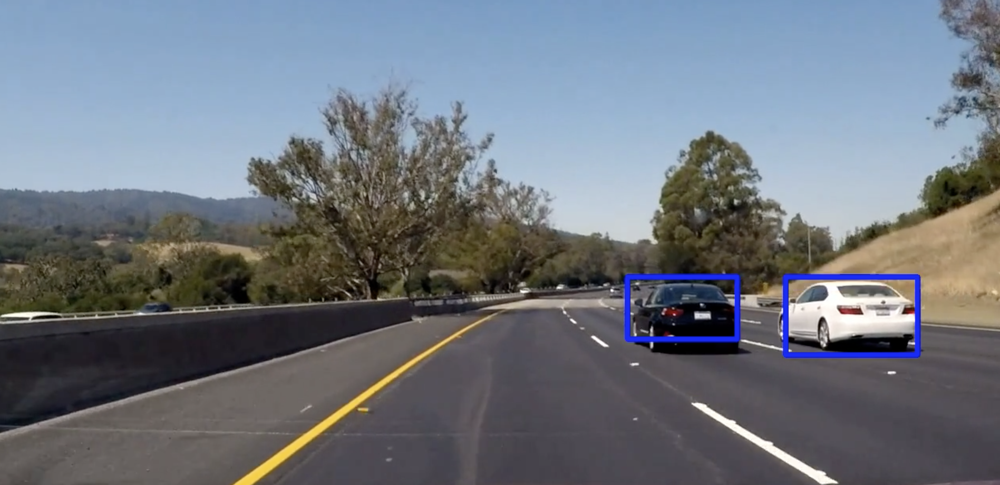

# **Project 5: Vehicle Detection and Tracking** 

The goal of this project is to detect and track vehicles on the road. It forms a basis for planning the steering actions of an autonomous car.

It is a part of the Udacity nanodegree Self Driving Cars, term 1. 

---

### The Vehicle Detector/Tracker

##### Description
The vehicle detector/tracker is described in [Project Report.md](./Project_Report.md). 

##### Implementation
The vehicle detector/tracker is implemented in the Jupyter notebook [Vehicle Detection Tracking.ipynb](./Vehicle_Detection_Tracking.ipynb).

##### Example output
Example videos of the lane line detector in action can be found in [this directory](./test_videos_output).